# Penetration Testing Report – TIKI

## Target Information

| Field | Details |
|---|---|
| Machine Description | A deliberately vulnerable lab machine for practicing web application exploits, privilege escalation, and post-exploitation techniques. |
| Target IP | `192.168.0.175` |
| Vulnerability Name | CMS Authentication Bypass, SMB Null Session Misconfiguration, Credential Exposure |
| Port / Service | `TCP 80 / HTTP`, `TCP 22 / SSH` |
| Severity | Critical (9.3) |
| Attack Vector | `CVSS:3.0/AV:L/AC:L/PR:N/UI:N/S:C/C:H/I:H/A:H` |

---

# Proof of Concept (PoC)

## Step 1 – Discover Target IP

```bash
nmap -sn 192.168.0.0/24
```

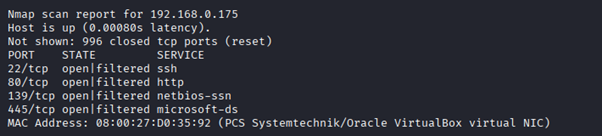

---

## Step 2 – Scan Open Ports and Services

```bash
nmap -p- -sC -sV 192.168.0.175 --open
```

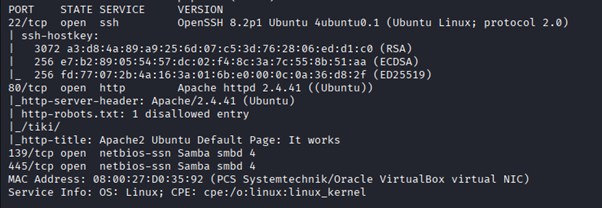

---

## Step 3 – Discover Hidden Page Using Wfuzz

A hidden `index.html` page was discovered using Wfuzz.

```bash
wfuzz -c -w /usr/share/wordlists/dirbuster/directory-list-2.3-medium.txt --hc 404 http://192.168.0.175/FUZZ
```

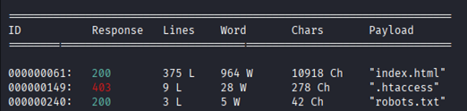

---

## Step 4 – Discover CMS

Further enumeration revealed a CMS installation running on the target.

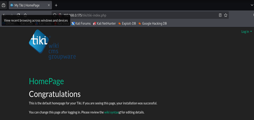

---

## Step 5 – Enumerate SMB Null Sessions

SMB allowed anonymous/null-session access.

```bash
enum4linux 192.168.0.175
```

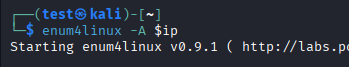

---

## Step 6 – Retrieve Sensitive File

A file was retrieved through SMB access without authentication.

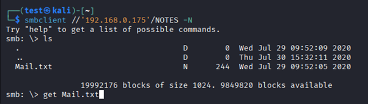

---

## Step 7 – Discover CMS Credentials

Credentials for the CMS were identified from the retrieved files.

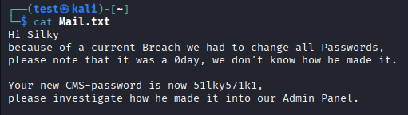

---

## Step 8 – Login to CMS

Authenticated access to the CMS was achieved.

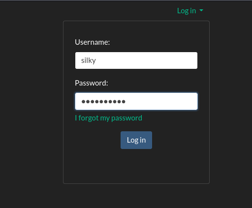

---

## Step 9 – Enumerate CMS Version

The CMS version was identified through the `changelog.txt` file.

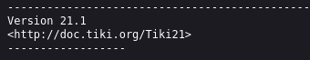

---

## Step 10 – Identify Authentication Bypass Exploit

A known exploit affecting the identified CMS version was located.

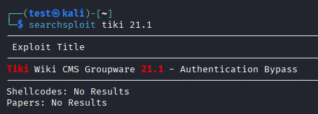

---

## Step 11 – Bypass CMS Authentication

The exploit was used to bypass authentication and gain administrator access.

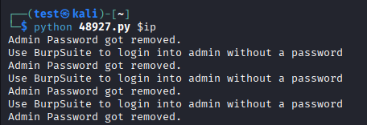

---

## Step 12 – Manipulate Authentication Request Using Burp Suite

The login request was intercepted using Burp Suite and the password parameter was modified before forwarding the request.

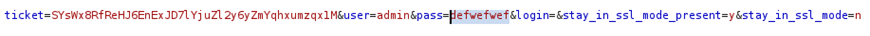

---

## Step 13 – Gain Administrator Access

Administrative privileges were successfully obtained.

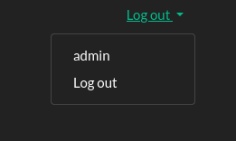

---

## Step 14 – Discover Additional Credentials

Further enumeration inside the CMS revealed system credentials.

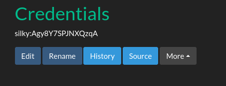

---

## Step 15 – Login via SSH

The discovered credentials were used to gain SSH access.

```bash
ssh user@192.168.0.175
```

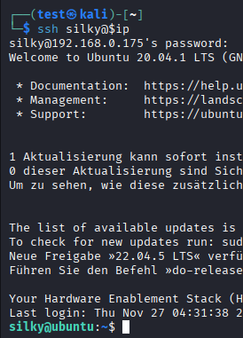

---

## Step 16 – Enumerate Sudo Privileges

The user `silky` was identified as a sudo-capable account.

```bash
sudo -l
```

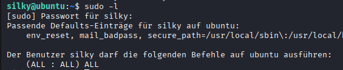

---

## Step 17 – Obtain Root Access

Privilege escalation was performed successfully, resulting in root access.

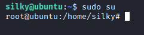

---

# Remediation

- Patch or update the CMS to the latest secure version.
- Disable SMB null sessions and enforce authentication.
- Remove publicly accessible sensitive files.
- Prevent directory listing on web services.
- Enforce strong password policies and rotate exposed credentials.
- Restrict SSH access and prefer key-based authentication.
- Apply least-privilege principles to sudo configurations.

---

# Impact

- Authentication bypass leads to unauthorized administrative access.
- SMB null sessions expose sensitive files and credentials.
- Attackers can gain remote shell access through SSH.
- Misconfigured sudo privileges allow privilege escalation to root.
- Full compromise of confidentiality, integrity, and availability of the system.

---

# References

- https://owasp.org/www-project-top-ten/
