# Penetration Testing Report – DC-4

## Target Information

| Field | Details |
|---|---|
| Machine Description | A deliberately vulnerable lab machine for practicing web application exploits, privilege escalation, and post-exploitation techniques. |
| Target IP | `192.168.0.152` |
| Vulnerability Name | Weak Passwords & Privilege Escalation (Bruteforce Login + Insecure Script) |
| Port / Service | `TCP 80 / HTTP` |
| Severity | High (8.1) |
| Attack Vector | `CVSS:3.0/AV:L/AC:H/PR:N/UI:N/S:C/C:H/I:H/A:H` |

---

# Proof of Concept (PoC)

## Step 1 – Discover Target IP

```bash
nmap -sn 192.168.0.0/24
```

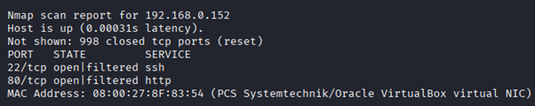

---

## Step 2 – Scan Open Ports and Services

```bash
nmap -p- -sC -sV 192.168.0.152 --open
```

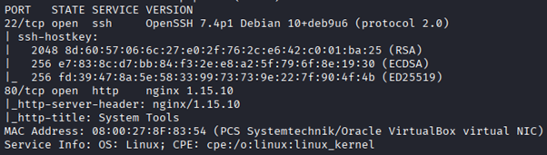

---

## Step 3 – Discover Login Page

A web login page was identified on the target application.

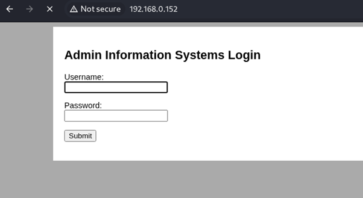

---

## Step 4 – Capture Authentication Request

The login request was intercepted using Burp Suite.

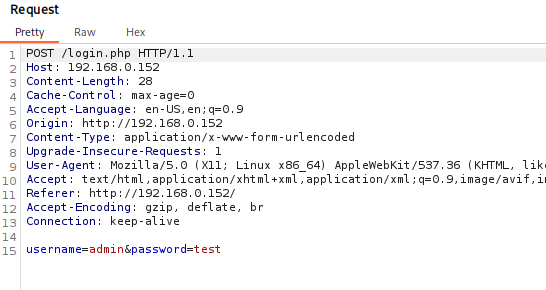

---

## Step 5 – Send Request to Intruder

The captured request was forwarded to Burp Suite Intruder.

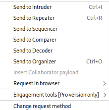

---

## Step 6 – Configure Password Bruteforce Attack

The password parameter was selected for bruteforce testing.

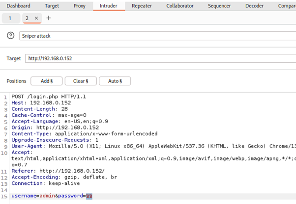

---

## Step 7 – Load Wordlist

The `rockyou.txt` wordlist was loaded into Burp Suite Intruder.

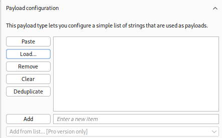

---

## Step 8 – Prepare Attack Payloads

Burp Suite generated and loaded all password payloads.

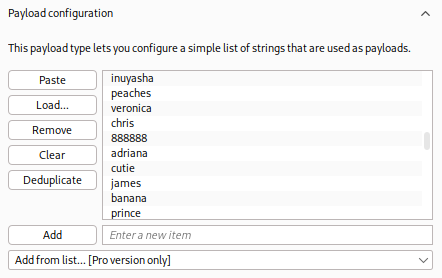

---

## Step 9 – Launch Bruteforce Attack

The Intruder attack was executed against the login form.

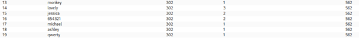

---

## Step 10 – Identify Valid Credentials

A successful response was identified through a different response length.

Discovered password:

```text
happy
```

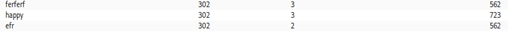

---

## Step 11 – Login Successfully

Authenticated access to the application was achieved.

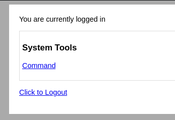

---

## Step 12 – Execute System Commands

The application functionality allowed operating system command execution.

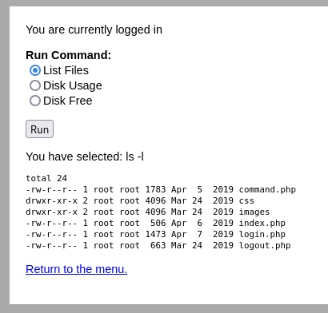

---

## Step 13 – Establish Reverse Shell

A reverse shell was obtained using Netcat.

```bash
nc -lvnp 4444
```

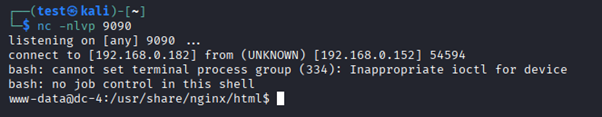

---

## Step 14 – Discover Stored Passwords

Historical passwords were found in a local file.

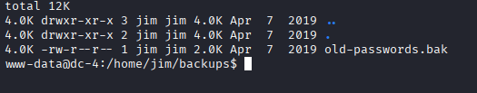

---

## Step 15 – Brute Force SSH Credentials

Hydra was used against the SSH service.

```bash
hydra -L users.txt -P passwords.txt ssh://192.168.0.152
```

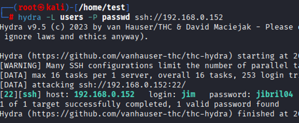

---

## Step 16 – Obtain Credentials for User Charles

Valid credentials for user `charles` were identified.

```text
^xHhA&hvim0y
```

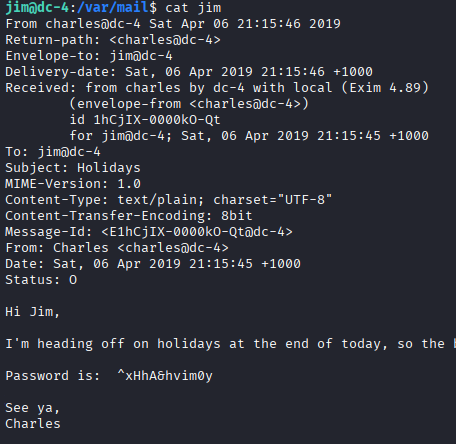

---

## Step 17 – Identify Vulnerable Script

A privileged script with insecure permissions was discovered.

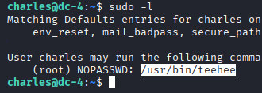

---

## Step 18 – Abuse Script to Modify System Files

The vulnerable script was abused to append entries into `/etc/passwd`.

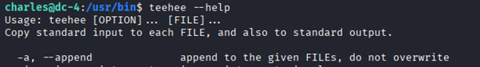

---

## Step 19 – Escalate Privileges

The manipulated configuration enabled privilege escalation.

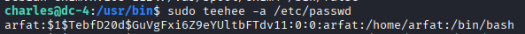

---

## Step 20 – Obtain Root Access

Root-level access was successfully achieved.

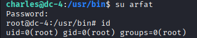

##PROOF

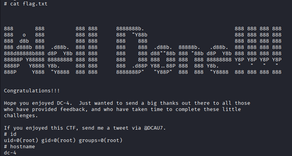

---

# Remediation

- Enforce strong password complexity requirements.
- Enable account lockout mechanisms and rate limiting.
- Disable brute-force opportunities through MFA.
- Remove plaintext or historical passwords from the system.
- Audit privileged scripts and remove insecure permissions.
- Apply least-privilege principles.
- Restrict SSH access to authorized users only.
- Regularly review user accounts and access rights.

---

# Impact

- Unauthorized access through weak credentials.
- Compromise of application accounts.
- Remote command execution on the server.
- Exposure of sensitive credentials.
- Lateral movement between user accounts.
- Privilege escalation to root access.
- Complete compromise of the target system.

---

# References

- https://owasp.org/www-community/attacks/Weak_passwords
- https://owasp.org/www-community/Broken_Access_Control
- https://www.ncsc.gov.uk/collection/passwords
- https://www.crowdstrike.com/en-us/cybersecurity-101/cyberattacks/privilege-escalation/
