# Penetration Testing Report – DC-5

## Target Information

| Field | Details |
|---|---|
| Machine Description | A deliberately vulnerable lab machine for practicing web app exploits, privilege escalation, and post-exploitation to gain user and root access. |
| Target IP | `192.168.0.149` |
| Vulnerability Name | Local File Inclusion (LFI) leading to Remote Code Execution (RCE), Privilege Escalation via SUID Misconfiguration (`screen-4.5.0`) |
| Port / Service | `TCP 80 / HTTP` |
| Severity | High (8.4) |
| Attack Vector | `CVSS:3.0/AV:L/AC:L/PR:N/UI:N/S:U/C:H/I:H/A:H` |

---

# Proof of Concept (PoC)

## Step 1 – Discover Target IP

```bash
nmap -sn 192.168.0.0/24
```


---

## Step 2 – Scan Open Ports and Services

```bash
nmap -p- -sC -sV $ip --open
```


---

## Step 3 – Discover Contact Page

A contact page was discovered during web application enumeration.

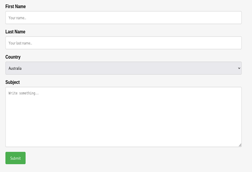

---

## Step 4 – Identify thankyou.php Processing Page

Analysis revealed that all submitted data was processed by `thankyou.php`.

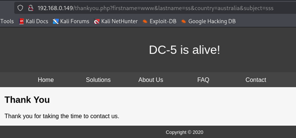

---

## Step 5 – Discover Hidden File Parameter

A hidden parameter named `file` was identified.

```text
file=
```

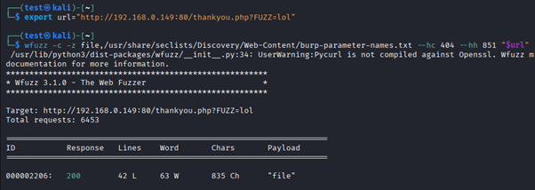

---

## Step 6 – Test for Local File Inclusion

The parameter was manipulated to verify Local File Inclusion behavior.


---

## Step 7 – Access Nginx Log Files

The LFI vulnerability allowed access to Nginx log files.


---

## Step 8 – Poison Log Files

The Nginx access logs were poisoned with a malicious payload.

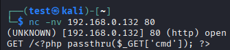

---

## Step 9 – Prepare Listener

A Netcat listener was started to receive the reverse shell connection.

```bash
nc -lvnp 4444
```


---

## Step 10 – Execute Reverse Shell Payload

The payload was URL encoded and executed through the vulnerable parameter.


---

## Step 11 – Obtain Shell Access

A reverse shell connection was successfully established.

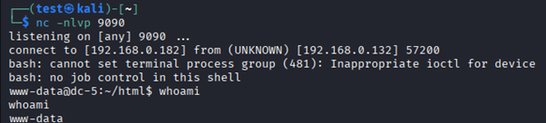

---

## Step 12 – Enumerate SUID Binaries

A vulnerable SUID binary named `screen-4.5.0` was identified.

```bash
find / -perm -u=s -type f 2>/dev/null
```

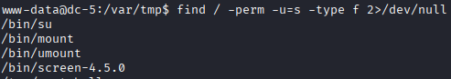

---

## Step 13 – Locate Privilege Escalation Exploit

A known exploit targeting the vulnerable version was located.

```text
41154.sh
```

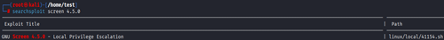

---

## Step 14 – Transfer Exploit

The exploit was transferred to the target machine.

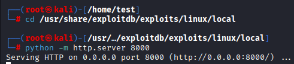

---

## Step 15 – Set Execution Permissions

Execution permissions were assigned to the exploit.

```bash
chmod +x 41154.sh
```

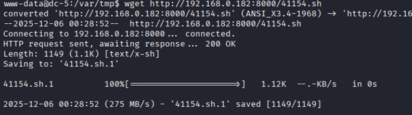

---

## Step 16 – Execute Exploit and Gain Root

The exploit was executed successfully, resulting in root privileges.

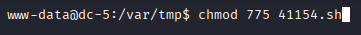

##PROOF

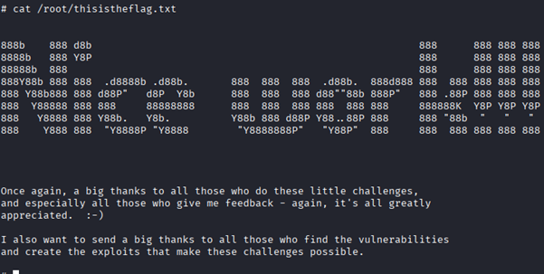

---

# Remediation

- Block unsafe file inclusion parameters such as `file=`.
- Validate and sanitize all user input.
- Implement allowlists for file access operations.
- Update or remove vulnerable versions of `screen`.
- Remove unnecessary SUID permissions.
- Apply operating system and application security patches.
- Conduct regular vulnerability assessments and code reviews.

---

# Impact

- Unauthorized access to sensitive system files.
- Remote Code Execution on the target server.
- Privilege escalation to root access.
- Complete system compromise.
- Data theft, modification, or destruction.
- Loss of confidentiality, integrity, and availability.

---

# References

- https://owasp.org/www-community/attacks/Local_File_Inclusion
- https://owasp.org/www-community/vulnerabilities/Code_Injection
- https://owasp.org/www-project-top-ten/
