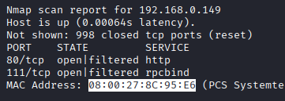
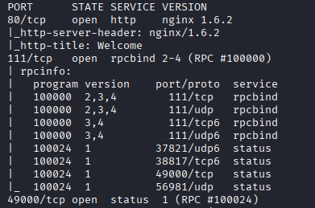
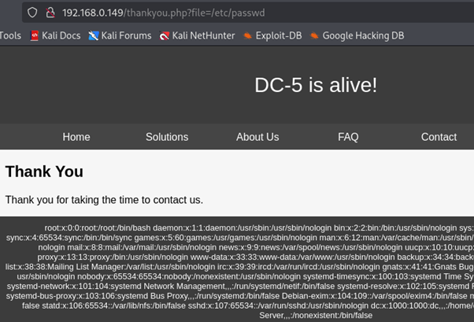
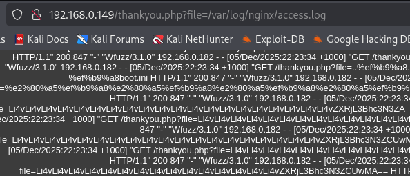
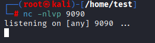
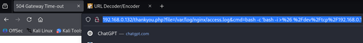
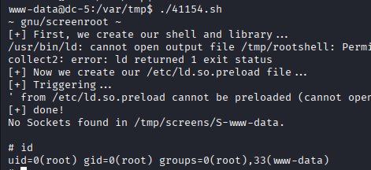
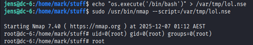

# Penetration Testing Report – DC-6

## Target Information

| Field | Details |
|---|---|
| Machine Description | A deliberately vulnerable lab machine for practicing web app exploits, privilege escalation, and post-exploitation to gain user and root access. |
| Target IP | `192.168.0.141` |
| Vulnerability Name | Weak WordPress Passwords, WordPress User Enumeration, Vulnerable Activity Monitor Script, Weak System Password Found, Sudo Misconfiguration, Nmap NSE Execution as Root |
| Port / Service | `TCP 80 / HTTP` |
| Severity | High (8.1) |
| Attack Vector | `CVSS:3.0/AV:L/AC:H/PR:N/UI:N/S:C/C:H/I:H/A:H` |

---

# Proof of Concept (PoC)

## Step 1 – Discover Target IP

```bash
nmap -sn 192.168.0.0/24
```



---

## Step 2 – Scan Open Ports and Services

```bash
nmap -p- -sC -sV $ip --open
```



---

## Step 3 – Discover WordPress Login Page

A WordPress login portal was discovered during web application enumeration.


---

## Step 4 – Enumerate WordPress Users

Multiple WordPress users were identified using WPScan.

```bash
wpscan --url http://192.168.0.141 --enumerate u
```


---

## Step 5 – Analyze Author's Hint

A clue provided by the machine author suggested filtering `rockyou.txt` for passwords containing `k01`.

```bash
cat /usr/share/wordlists/rockyou.txt | grep k01 > passwords.txt
```


---

## Step 6 – Discover Valid Credentials

A valid password was identified for user `mark`.



---

## Step 7 – Login Successfully

Authenticated access to the target application was achieved.



---

## Step 8 – Identify Activity Monitor Exploit

A known exploit targeting the vulnerable Activity Monitor plugin was discovered.

```text
50110.py
```


---

## Step 9 – Configure Exploit

The exploit required a valid username, password, and target IP address.



---

## Step 10 – Execute Exploit

The exploit was executed against the vulnerable application.



---

## Step 11 – Setup Netcat Listener

A Netcat listener was started to receive a reverse shell connection.

```bash
nc -lvnp 4444
```


---

## Step 12 – Obtain Interactive Shell

A working shell was obtained on the target machine.


---

## Step 13 – Discover Additional Password

Further enumeration revealed another valid password on the system.


---

## Step 14 – Enumerate Sudo Privileges

Sudo permissions available to the compromised user were identified.

```bash
sudo -l
```


---

## Step 15 – Modify Vulnerable Script

Custom code was inserted into a vulnerable script.


---

## Step 16 – Execute Script as User Jens

The modified script was executed successfully as user `jens`.


---

## Step 17 – Discover Nmap Root Execution

The system allowed Nmap execution as root without requiring a password.

```bash
sudo -l
```



---

## Step 18 – Execute NSE Script and Gain Root

A custom `.nse` script was created and executed through Nmap, resulting in root access.



##Proof


---

# Remediation

- Enforce strong password policies for all users.
- Disable WordPress user enumeration through author archives and APIs.
- Remove or patch vulnerable plugins and scripts.
- Restrict command execution functionality.
- Audit and secure sudo configurations.
- Remove unnecessary NOPASSWD entries.
- Restrict Nmap execution by unprivileged users.
- Keep WordPress core, themes, and plugins fully updated.

---

# Impact

- Unauthorized access through weak credentials.
- User enumeration simplifies password attacks.
- Command execution vulnerabilities enable remote compromise.
- Attackers can move laterally between user accounts.
- Misconfigured sudo permissions allow privilege escalation.
- Nmap root execution can result in complete system compromise.
- Full loss of confidentiality, integrity, and availability.

---

# References

- https://wordpress.com/support/passwords/
- https://wordpress.com/support/security/
- https://www.kaspersky.com/resource-center/definitions/code-injection
- https://www.ncsc.gov.uk/collection/top-tips-for-staying-secure-online/passwords
- https://www.techtarget.com/searchsecurity/definition/privilege-escalation
- https://www.avast.com/c-privilege-escalation
